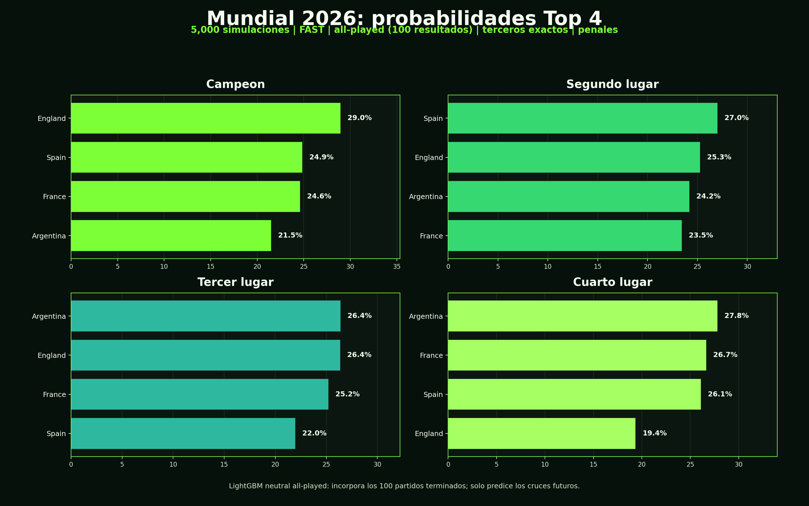

# ML Mundial 2026

Modelo de machine learning para prediccion de partidos del Mundial 2026. La
receta activa es un LightGBM neutral v7 conservador de 10 variables prepartido,
con 61/96 aciertos (`63.54%`) en el holdout oficial de partidos ya disputados
del Mundial 2026 al 2026-07-07.

| Evaluacion | Accuracy | Correctos | Partidos | Lectura rapida |
|---|---:|---:|---:|---|
| Test externo temporal | 63.46% | 66/104 | 104 | Diagnostico externo en partidos oficiales recientes no vistos |
| Test Mundial 2026 | 63.54% | 61/96 | 96 | Holdout principal: partidos reales ya jugados del Mundial |
| Test combinado objetivo | 60.10% | 119/198 | 198 | Mundial 2026 jugado mas partidos oficiales recientes |
| Artefacto all-played | N/A | N/A | 883 train | Modelo para predicciones futuras con resultados jugados incorporados |

## Pronostico visual del torneo

La grafica principal usa cuatro paneles separados para mostrar las
probabilidades de terminar primero, segundo, tercero o cuarto. El flujo actual
de simulacion usa el artefacto all-played v7, con todos los partidos ya jugados
incorporados antes de predecir cruces pendientes, asignacion exacta de mejores
terceros y avance por penales en eliminatorias.



Pipeline reproducible para recolectar datos de futbol, construir variables
prepartido, entrenar el modelo y simular el torneo.

El repositorio contiene datos estaticos necesarios para el
calendario/resultados manuales, scripts operativos y pruebas automatizadas. Los
datos crudos, matrices generadas, modelos entrenados y salidas de prediccion se
mantienen fuera de Git.

Este repositorio se publica como demostracion tecnica y portafolio. El codigo,
la arquitectura del modelo, el diseno de features, reportes y assets son
propietarios; no se concede permiso para copiar, reutilizar, redistribuir o
explotar comercialmente el proyecto sin autorizacion previa.

## Fuentes

| Fuente | Uso | Credencial |
|---|---|---|
| StatsBomb Open Data | Historial abierto de Mundial para contexto base | No |
| API-Football | Partidos recientes, estadisticas, lineups y jugadores | `APISPORTS_KEY` |
| football-data.org | Calendarios, resultados y contexto de competiciones | `FOOTBALL_DATA_TOKEN` |
| ESPN/theScore | Actualizacion puntual de resultados del Mundial 2026 | No |

Las respuestas originales se guardan en `data/raw/` y se reutilizan desde cache.
Los artefactos generados se escriben en `data/processed/`, `data/models/` y
`outputs/`; esas rutas estan ignoradas para mantener el repo liviano.

Las credenciales de proveedores no se versionan. API-Football tiene una cuota
diaria limitada, por lo que la recoleccion completa esta pensada como un paso
operativo del mantenedor del proyecto.

## Instalacion

```powershell
python -m venv .venv
.\.venv\Scripts\Activate.ps1
pip install -e ".[dev]"
pytest
```

## Nueva PC / setup portable

Para mover el estado actual del modelo a otra computadora sin volver a
recolectar datos, usar el flujo portable documentado en
[`docs/new_pc_setup.md`](docs/new_pc_setup.md). El repo via GitHub contiene el
codigo; el ZIP portable via Drive contiene `data/`, modelos entrenados y el
fixture necesario para simular.

## Pipeline principal

El proyecto sigue una sola secuencia de trabajo:

1. Recolectar datos de proveedores y guardarlos en cache local.
2. Normalizar las fuentes a tablas consistentes.
3. Construir el frame de entrenamiento nacional.
4. Exportar la matriz limpia y la matriz final del modelo.
5. Entrenar el modelo holdout del Mundial.
6. Recalcular metricas y reporte tecnico.
7. Simular el torneo y regenerar el visual publico.

### 1. Recoleccion

```powershell
kinela collect fifa-ranking
kinela collect football-data-bulk
kinela collect api-football-world-cup-teams --last 15 --detail-limit 100
```

### 2. Limpieza y normalizacion

```powershell
kinela normalize api-football
kinela normalize football-data
kinela normalize fifa-ranking
```

### 3. Features y matrices

```powershell
kinela export training-frame-national
kinela export clean-training-matrix-national
kinela export neutral-training-matrix-national
```

### 4. Entrenamiento

```powershell
python scripts\train_worldcup2026_holdout_model.py
```

### 5. Metricas

```powershell
python scripts\update_worldcup2026_manual_detail_from_espn.py
python scripts\update_worldcup2026_manual_detail_from_thescore.py
python scripts\audit_worldcup2026_manual_detail_coverage.py
python scripts\worldcup2026_model_metrics.py
python scripts\generate_model_evaluation_report.py
```

### 6. Simulacion del torneo

```powershell
python scripts\run_worldcup2026_consensus_bracket.py --runs 5000 --workers 8 --seed 42 --progress-every 25 --model-path data\models\lightgbm_neutral_all_played_wc2026.joblib --model-label all_played_wc2026_v7_full_context_5000 --output outputs\worldcup2026_consensus_bracket_5000_v7.json
python scripts\generate_worldcup2026_top4_visual.py --input outputs\worldcup2026_consensus_bracket_5000_v7.json
```

## Evaluacion del modelo

El reporte tecnico con cortes temporales, metricas, matrices de confusion,
analisis de error e importancia de features esta en
[`docs/model_evaluation.md`](docs/model_evaluation.md).

## Modelo

El modelo de produccion usa variables prepartido de ranking, forma reciente,
balance de goles, contexto de fase, score timing validado, historia actual del
Mundial y ventaja de finalizador diferencial.

La evaluacion principal reporta accuracy sobre partidos ya jugados del Mundial
2026. Esos partidos se separan como test y no se usan para entrenar el modelo
que calcula ese accuracy. Las predicciones futuras y simulaciones largas usan
el artefacto all-played, que incorpora todos los resultados ya jugados antes de
predecir cruces pendientes.

## Estructura

```text
src/kinela/        Codigo del paquete y CLI
scripts/           Scripts operativos de actualizacion, auditoria y prediccion
tests/             Pruebas automatizadas
data/static/       Calendario, resultados manuales y configuracion estatica
.github/workflows/ CI y recoleccion programada
```

## Higiene del repositorio

El repo mantiene fuera de Git los insumos pesados, credenciales y artefactos
generados. Por defecto no versiona:

- credenciales locales ni archivos `.env`
- respuestas crudas de proveedores
- matrices procesadas
- modelos entrenados
- predicciones, reportes y hojas generadas

## GitHub Actions

`CI` ejecuta lint y pruebas.

`Collect football data` es una automatizacion operativa para el mantenedor:
requiere secrets de proveedores, usa cache de respuestas y esta limitada por la
cuota diaria de las APIs. No es la via principal para que un usuario externo
pruebe el modelo; el orden reproducible del proyecto esta documentado en el
pipeline principal.

## Licencia

Copyright (c) 2026 MoraVevo. Todos los derechos reservados. Este proyecto se
publica para revision de portafolio y demostracion tecnica; cualquier uso,
copia, modificacion, redistribucion o explotacion comercial requiere permiso
previo por escrito.
