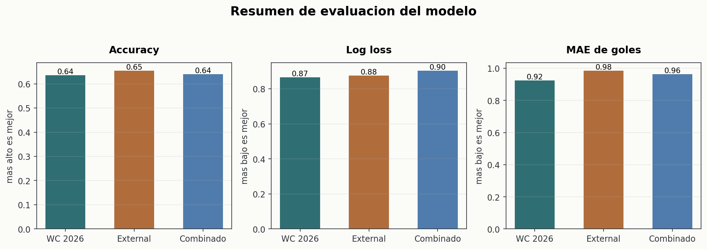
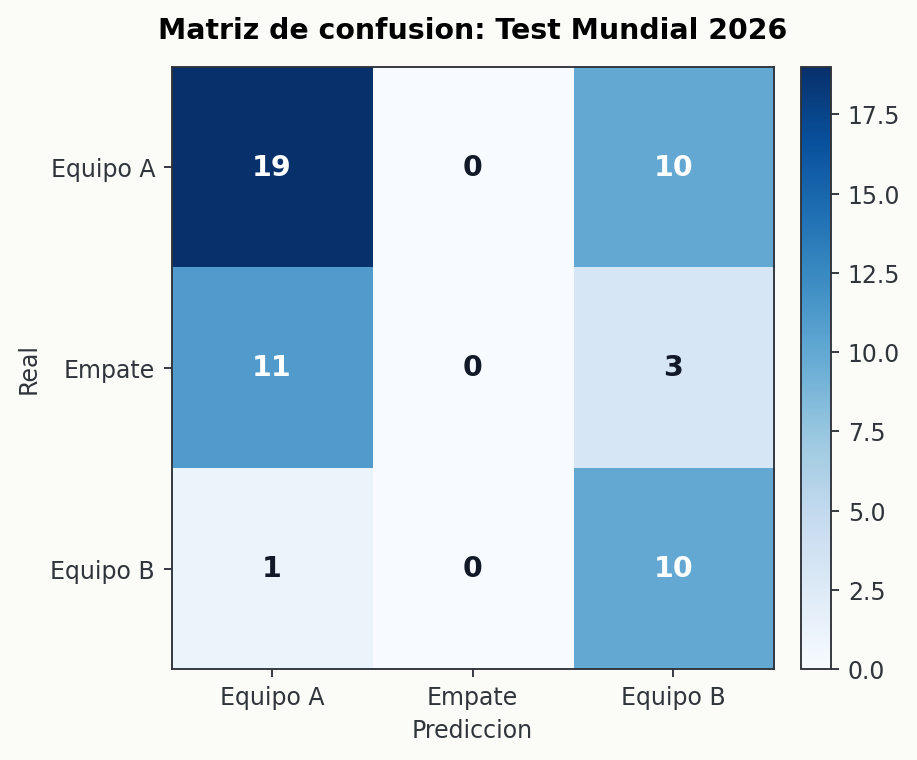
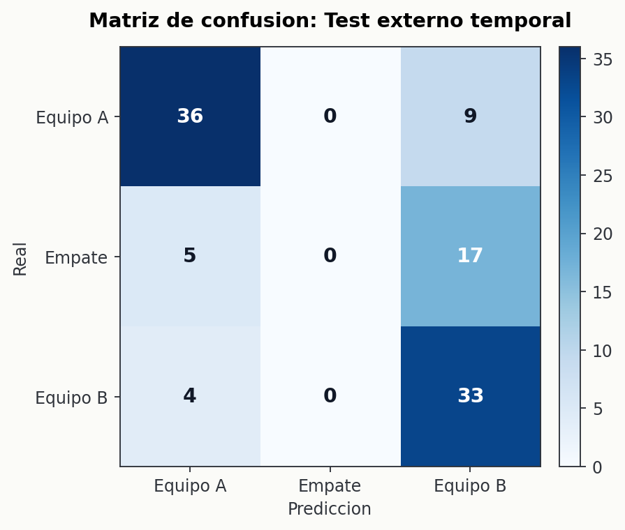
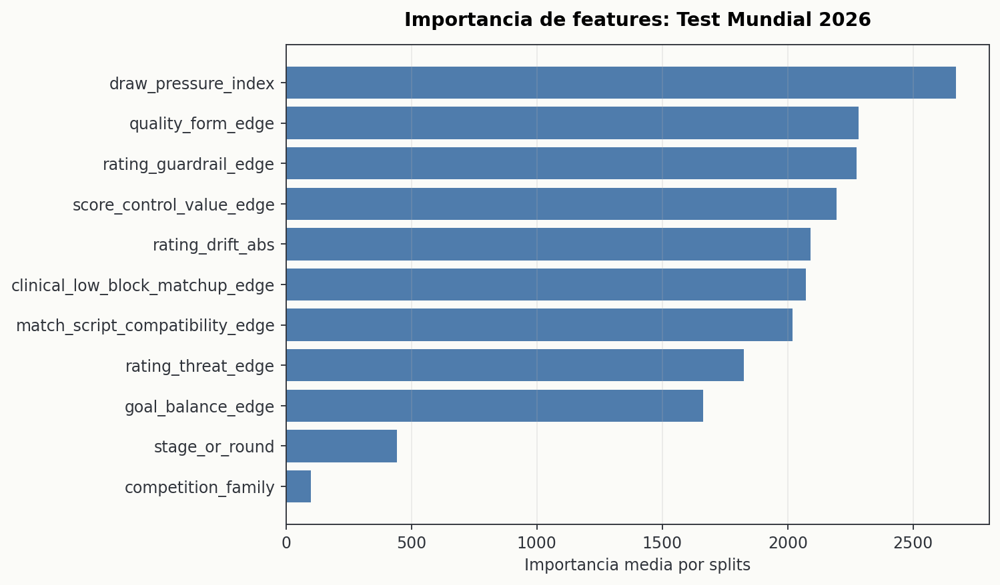
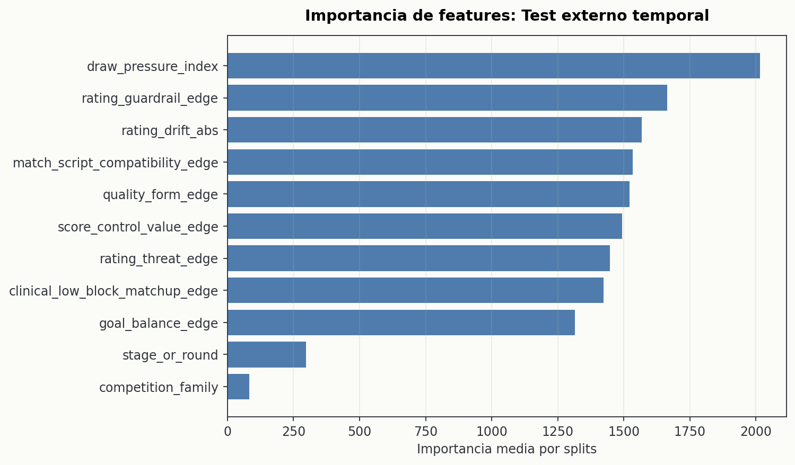

# Evaluacion del modelo

Este reporte evalua el modelo neutral con cortes temporales disenados para que los partidos de test no entren al entrenamiento.

Identificador del modelo: `neutral_worldcup_v1`

## Politicas de test

### Test Mundial 2026

Los partidos jugados del Mundial 2026 se fuerzan como test. El entrenamiento usa solo partidos de selecciones anteriores al primer partido del Mundial 2026; esos partidos de test no se usan para entrenar.

- Partidos de entrenamiento: 787
- Partidos de test: 54
- Ventana de test: 2026-06-11 a 2026-06-25

### Test externo temporal

Test aleatorio de 104 partidos nacionales no amistosos y fuera del Mundial 2026, tomados del pool reciente de partidos oficiales, seed=42. El entrenamiento usa solo partidos anteriores a la primera fecha seleccionada de test; los partidos seleccionados como test no se usan para entrenar.

- Partidos de entrenamiento: 565
- Partidos de test: 104
- Ventana de test: 2024-09-07 a 2026-03-26

## Metricas

| Evaluacion | Accuracy | Correctos | Log loss | MAE equipo A | MAE equipo B | MAE prom. |
|---|---:|---:|---:|---:|---:|---:|
| Test Mundial 2026 | 0.5370 | 29/54 | 0.9762 | 1.1763 | 0.8515 | 1.0139 |
| Test externo temporal | 0.6635 | 69/104 | 0.8949 | 0.9929 | 1.0552 | 1.0240 |

## Interpretacion tecnica

El modelo es util para direccionar ganadores, pero el umbral actual es conservador con los empates. En estos tests asigna probabilidad al empate para calibracion via log loss, pero la clase con mayor probabilidad casi nunca termina siendo `empate`.

| Evaluacion | Empates reales | Empates predichos como clase principal |
|---|---:|---:|
| Test Mundial 2026 | 14 | 0 |
| Test externo temporal | 22 | 0 |

Por eso se muestra log loss junto a accuracy: accuracy sola oculta si el modelo esta asignando probabilidad util a empates y partidos cerrados. El MAE se reporta aparte porque los regresores de goles pueden estar razonablemente calibrados aunque el clasificador 1X2 elija otra clase.

## Matrices de confusion

### Test Mundial 2026

### Test externo temporal

## Importancia de features

### Test Mundial 2026

| Feature | Importancia |
|---|---:|
| `draw_pressure_index` | 2670.00 |
| `quality_form_edge` | 2282.67 |
| `rating_guardrail_edge` | 2274.00 |
| `score_control_value_edge` | 2194.67 |
| `rating_drift_abs` | 2089.67 |
| `clinical_low_block_matchup_edge` | 2071.00 |
| `match_script_compatibility_edge` | 2018.00 |
| `rating_threat_edge` | 1825.00 |

### Test externo temporal

| Feature | Importancia |
|---|---:|
| `draw_pressure_index` | 2014.67 |
| `rating_guardrail_edge` | 1664.00 |
| `rating_drift_abs` | 1568.67 |
| `match_script_compatibility_edge` | 1532.67 |
| `quality_form_edge` | 1521.67 |
| `score_control_value_edge` | 1494.33 |
| `rating_threat_edge` | 1446.33 |
| `clinical_low_block_matchup_edge` | 1423.00 |

## Analisis de error

Las siguientes tablas ordenan los grupos por mayor MAE promedio de goles. Sirven para ver donde el modelo sufre mas, no como ranking definitivo: algunos grupos tienen pocas observaciones.

### Test Mundial 2026

#### Por competicion

| Grupo | Partidos | Accuracy | Log loss | MAE equipo A | MAE equipo B | MAE prom. |
|---|---:|---:|---:|---:|---:|---:|
| FIFA World Cup | 54 | 0.5370 | 0.9762 | 1.1763 | 0.8515 | 1.0139 |

#### Por fase/ronda

| Grupo | Partidos | Accuracy | Log loss | MAE equipo A | MAE equipo B | MAE prom. |
|---|---:|---:|---:|---:|---:|---:|
| GROUP_STAGE | 54 | 0.5370 | 0.9762 | 1.1763 | 0.8515 | 1.0139 |

#### Por resultado real

| Grupo | Partidos | Accuracy | Log loss | MAE equipo A | MAE equipo B | MAE prom. |
|---|---:|---:|---:|---:|---:|---:|
| Equipo A | 29 | 0.6552 | n/a | 1.3875 | 0.7993 | 1.0934 |
| Equipo B | 11 | 0.9091 | n/a | 0.7719 | 1.3160 | 1.0439 |
| Empate | 14 | 0.0000 | n/a | 1.0565 | 0.5947 | 0.8256 |

### Test externo temporal

#### Por competicion

| Grupo | Partidos | Accuracy | Log loss | MAE equipo A | MAE equipo B | MAE prom. |
|---|---:|---:|---:|---:|---:|---:|
| World Cup - Qualification Europe | 40 | 0.8250 | 0.7719 | 1.2239 | 1.0468 | 1.1353 |
| World Cup - Qualification Africa | 19 | 0.7895 | 0.8000 | 0.9604 | 1.2187 | 1.0896 |
| UEFA Nations League | 29 | 0.4483 | 1.0566 | 0.8845 | 0.9754 | 0.9300 |
| African Nations Championship - Qualification | 2 | 0.5000 | n/a | 0.5666 | 1.2570 | 0.9118 |
| CONCACAF Nations League | 9 | 0.6667 | 0.9229 | 0.6149 | 1.1211 | 0.8680 |
| Gulf Cup of Nations | 5 | 0.2000 | 1.1903 | 0.7472 | 0.7638 | 0.7555 |

#### Por fase/ronda

| Grupo | Partidos | Accuracy | Log loss | MAE equipo A | MAE equipo B | MAE prom. |
|---|---:|---:|---:|---:|---:|---:|
| League A - 1 | 1 | 1.0000 | n/a | 3.1572 | 1.2302 | 2.1937 |
| League B - 6 | 1 | 1.0000 | n/a | 2.4988 | 0.8822 | 1.6905 |
| League A - 5 | 2 | 1.0000 | 0.6434 | 2.2743 | 0.7022 | 1.4883 |
| GROUP_STAGE | 61 | 0.7869 | 0.7969 | 1.0822 | 1.1030 | 1.0926 |
| Play-offs A/B | 3 | 0.0000 | 1.4196 | 1.2841 | 0.8250 | 1.0546 |
| League A - 2 | 2 | 0.5000 | 1.0469 | 0.3279 | 1.7322 | 1.0300 |
| SEMI_FINALS | 4 | 0.5000 | 0.9984 | 1.3797 | 0.6402 | 1.0099 |
| QUARTER_FINALS | 9 | 0.3333 | 1.0716 | 0.7508 | 1.1954 | 0.9731 |

#### Por resultado real

| Grupo | Partidos | Accuracy | Log loss | MAE equipo A | MAE equipo B | MAE prom. |
|---|---:|---:|---:|---:|---:|---:|
| Equipo A | 45 | 0.8000 | n/a | 1.3552 | 0.7892 | 1.0722 |
| Empate | 22 | 0.0000 | n/a | 0.7525 | 1.2590 | 1.0057 |
| Equipo B | 37 | 0.8919 | n/a | 0.6952 | 1.2574 | 0.9763 |

## Construccion de features

El modelo activo usa 11 features prepartido:

| Feature | Significado |
|---|---|
| `competition_family` | Familia de competicion: Mundial, eliminatoria, torneo continental, Nations League u otra categoria nacional. |
| `stage_or_round` | Fase o ronda del partido. Da contexto competitivo: grupo, knockout, jornada, final, etc. |
| `rating_threat_edge` | Ventaja combinada de fuerza/ranking y amenaza ofensiva esperada entre Equipo A y Equipo B. |
| `quality_form_edge` | Forma reciente ajustada por calidad del rival, no solo puntos crudos. |
| `goal_balance_edge` | Diferencia de balance goleador reciente e historico: goles a favor menos goles recibidos. |
| `draw_pressure_index` | Indice de paridad y baja separacion esperada; ayuda a calibrar partidos cerrados. |
| `score_control_value_edge` | Ventaja en control de marcador: capacidad reciente de sostener o transformar estados de partido. |
| `rating_guardrail_edge` | Correccion de seguridad cuando las senales de amenaza se alejan demasiado del rating base. |
| `rating_drift_abs` | Magnitud del cambio reciente entre rating historico y rating vivo; captura incertidumbre/volatilidad. |
| `match_script_compatibility_edge` | Compatibilidad tactica estimada entre estilos de partido de ambos equipos. |
| `clinical_low_block_matchup_edge` | Cruce entre definicion ofensiva y capacidad/riesgo contra bloques bajos. |

Grupos conceptuales:

- Fuerza/rating: ranking FIFA, fuerza tipo Elo, guardrails y drift.
- Forma reciente: puntos ajustados por rival y balance de goles.
- Contexto del partido: tipo de competicion, fase/ronda y presion de empate.
- Perfil tactico/ofensivo: compatibilidad de guion de partido y matchup contra bloque bajo.

Quedan fuera de los features: goles objetivo, resultado final, ids crudos, fecha cruda, equipos, fuente y estadisticas postpartido del encuentro evaluado.

## Controles anti-leakage

El test Mundial 2026 es la metrica principal porque evalua el mismo tipo de partido que se quiere predecir. Esos partidos no se usan para entrenar: se separan como test y el modelo se ajusta solo con partidos anteriores al inicio del Mundial 2026.

El test externo temporal revisa si el modelo tambien se sostiene fuera del Mundial. Selecciona partidos oficiales nacionales fuera del Mundial 2026 y entrena solo con partidos anteriores al primer partido seleccionado como test. En otras palabras: el accuracy de cada test se calcula sobre partidos que el modelo no vio durante entrenamiento.

Ambas evaluaciones reconstruyen features antes de entrenar. La fecha se usa para cortes cronologicos y contexto rolling prepartido; no entra como feature directa.
